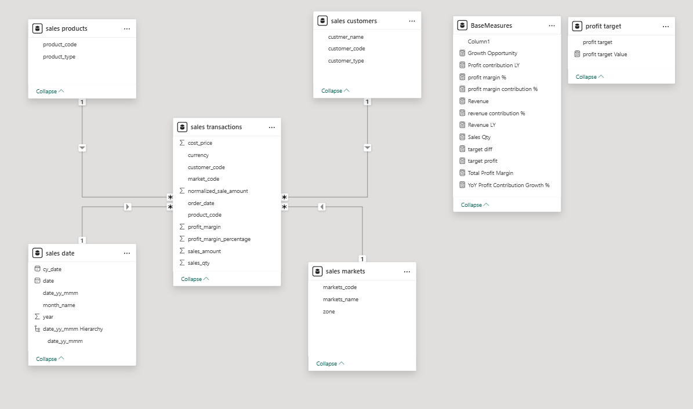
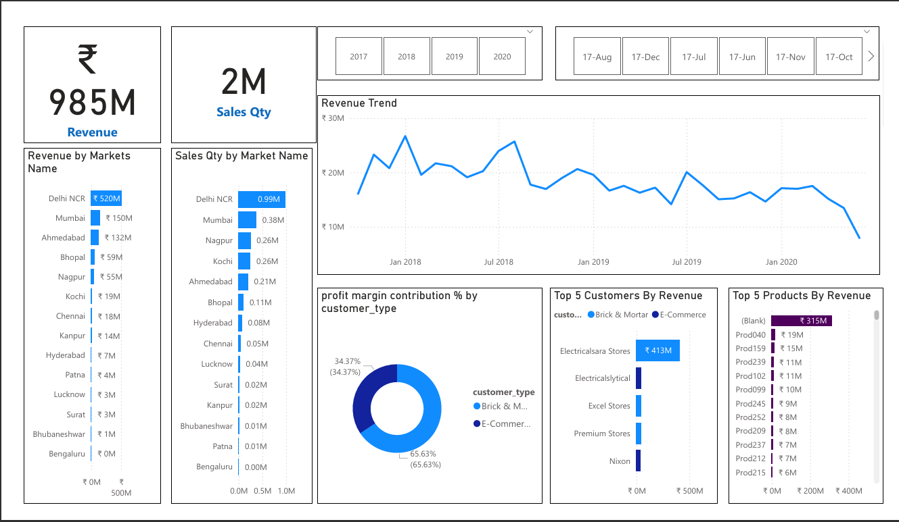
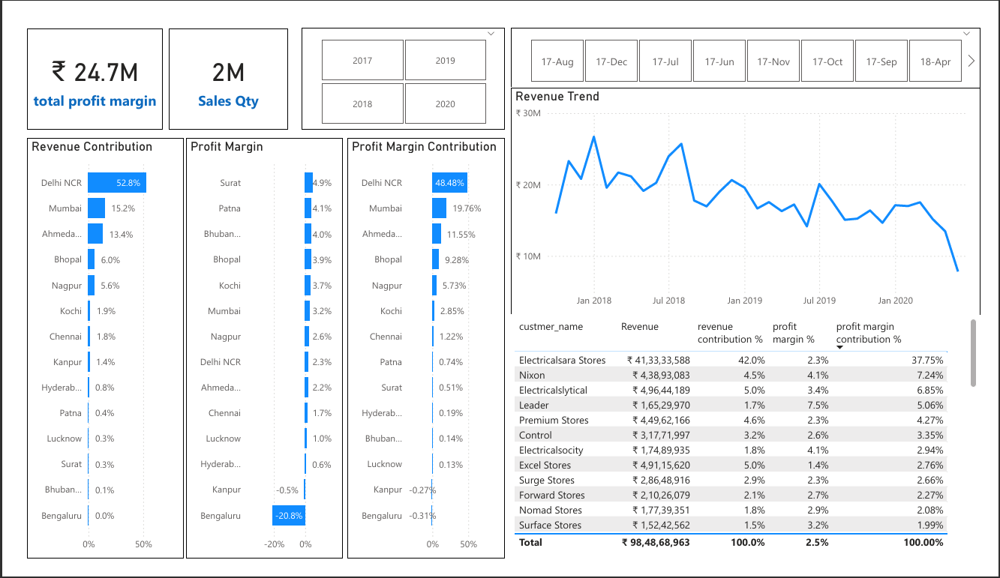

# Sales & Profit Analysis Dashboard (Power BI)

>  *A beginner-friendly Power BI project showcasing sales, revenue, and profit insights across multiple markets from 2017–2020.*

This dashboard helps students and beginners explore **data visualization**, **business insights**, and **Power BI fundamentals** while working with real sales metrics.  
It summarizes performance across various **Indian markets, customers, and products** using interactive visuals.

---
#  Data Model (Power BI)

### How the Data Is Organized

This project uses a **Star Schema** model to keep the dashboard fast, clean, and easy to understand.

### **Model Structure**

#  Dashboard Preview

### **Page 1 – Revenue Overview**

### **Page 2 – Profit Analysis**

### **Page 3 – Profit Target & Trend**

---

# What This Dashboard Shows

### **1. Key Insights**
- **Total Revenue:** ~₹985M
- **Total Sales Quantity:** ~2M units
- **Total Profit Margin:** ₹24.7M  
  (Shown on Page 1 and 2)

### **2. Revenue by Market**
- Markets like **Delhi NCR, Mumbai, Ahmedabad, Bhopal**, etc. ranked by revenue.
- Delhi NCR is the top performer.

### **3. Sales Quantity by Market**
- Shows which cities sell the most units.

### **4. Top Customers & Top Products**
- Includes *Electricalsara Stores, Nixon, Excel Stores* and more.
- Product-wise revenue bar chart.

### **5. Revenue Trend Over Time**
- Line chart from **Jan 2018 – 2020** with filters for year & month.

### **6. Profit Margin & Contribution**
- Profit margin % by market.
- Profit contribution by customer type (Brick & mortar vs E-commerce).
- Detailed customer table showing:
    - Revenue
    - Revenue contribution %
    - Profit margin %
    - Profit margin contribution %

### **7. Profit Target Page**
- Adjustable **profit target slider**.
- Combined chart showing:
    - Revenue
    - Last Year Revenue (LY)
    - Profit Margin %

# How to Open & Explore

1. Install **Power BI Desktop**.
2. Open `Sales_Profit_Dashboard.pbix`.
3. Use **year** & **month** slicers to explore data.
4. Hover on visuals for tooltips.
5. Scroll through tables for full customer list.
6. Export visuals or data if needed.

---

# Questions This Dashboard Helps Answer

- Which city generates the **highest revenue**?
- Who are the **top customers** and **top products**?
- How does revenue change month-to-month and year-to-year?
- Which markets have **high or low profit margins**?
- How close are we to the **profit target**?

---

# Skills Practiced

- Creating visuals: **bar charts, cards, donut charts, tables, line charts**
- Using **slicers** for filtering
- Working with **Power BI measures**
- Understanding **business KPIs**
- Designing a clear and structured dashboard

---

# Possible Improvements

- Add **forecasting models**
- Create **drill-through** pages (market-wise insights)
- Add **KPI indicators** (Actual vs Target)
- Build **tooltip pages**
- Connect to a **live database**

---

# Using This in Assignments or Portfolios

- Add dashboard screenshots to your project report.
- Write short insights like:
  > **“Delhi NCR contributes over 50% of total revenue and ~48% of total profit margin.”**
- Mention skills learned: Power BI, DAX, data visualization, dashboard design.

---

# Thank You!

Feel free to customize the visuals, add your own insights, or ask me if you want a **portfolio-optimized**, **minimal aesthetic**, or **GitHub-badge style** version of this README.

